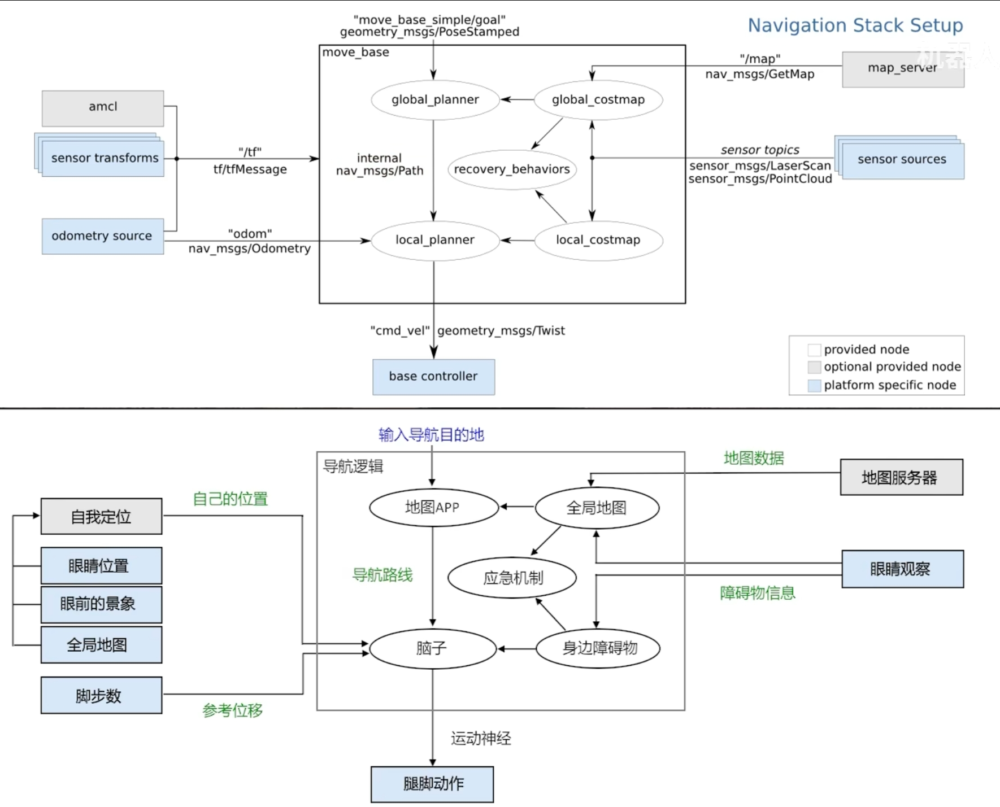

# 激光雷达导航学习

## livox 雷达配置

### 官方文档

使用手册：

[Livox_Mid-360_User_Manual_CHS.pdf (djicdn.com)](https://terra-1-g.djicdn.com/851d20f7b9f64838a34cd02351370894/Livox/Livox_Mid-360_User_Manual_CHS.pdf)

[Livox_Mid-360_Quick_Start_Guide_multi.pdf (djicdn.com)](https://dl.djicdn.com/downloads/Livox/Mid-360/QSG/Livox_Mid-360_Quick_Start_Guide_multi.pdf)

软件下载：

[Downloads - Mid-360 激光雷达 - Livox (livoxtech.com)](https://www.livoxtech.com/cn/mid-360/downloads)

通信协议：

[Welcome to LIVOX ! — Livox wiki 0.1 文档 (livox-wiki-cn.readthedocs.io)](https://livox-wiki-cn.readthedocs.io/zh-cn/latest/)

### 民间文档

[Livox_Mid-360激光雷达使用教程_livox mid360-CSDN博客](https://blog.csdn.net/m0_62948300/article/details/139782954)

### 配置环境

有一步是要你配置ip地址：

>Ubuntu-18.04 系统
>IP 地址的配置可以在终端中通过 ifconfig 命令配置，配置的示例代码如下:~$ sudo ifconfig enp4s0 192.168.1.50(其中，需要将 enp4s0 替换为本机的网口名称)

你输入ifconfig后，可能出现以下信息：

```shell
ens33: flags=4163<UP,BROADCAST,RUNNING,MULTICAST>  mtu 1500
        inet 192.168.42.128  netmask 255.255.255.0  broadcast 192.168.42.255
        inet6 fe80::5af1:9ba8:815a:95ad  prefixlen 64  scopeid 0x20<link>
        ether 00:0c:29:8d:6c:c4  txqueuelen 1000  (以太网)
        RX packets 56732  bytes 55726476 (55.7 MB)
        RX errors 21  dropped 0  overruns 0  frame 0
        TX packets 44737  bytes 6597983 (6.5 MB)
        TX errors 0  dropped 0 overruns 0  carrier 0  collisions 0
        device interrupt 19  base 0x2000  

lo: flags=73<UP,LOOPBACK,RUNNING>  mtu 65536
        inet 127.0.0.1  netmask 255.0.0.0
        inet6 ::1  prefixlen 128  scopeid 0x10<host>
        loop  txqueuelen 1000  (本地环回)
        RX packets 3223811  bytes 234009849 (234.0 MB)
        RX errors 0  dropped 0  overruns 0  frame 0
        TX packets 3223811  bytes 234009849 (234.0 MB)
        TX errors 0  dropped 0 overruns 0  carrier 0  collisions 0
```

其中，开头的“**`ens33`**”就是网口名称，所以你的命令应该是这样：

```shell
sudo ifconfig ens33 192.168.1.50
```


### ubuntu虚拟机连接配置

[Ubuntu 20.04使用Livox Mid-360_livox mid360 ubuntu20-CSDN博客](https://blog.csdn.net/jjjqqq123321/article/details/135159929)

[虚拟机ubuntu20.04使用livox mid360测试fast_lio_虚拟机连接mid-CSDN博客](https://blog.csdn.net/Samsara13/article/details/134680603)

[VMware虚拟机配置Ubuntu桥接方式（！！！很简便！！！）_vmware workstation pro 12 ubuntu 桥接模式 动态ip-CSDN博客](https://blog.csdn.net/weixin_42627397/article/details/110826285)

[windows电脑cmd命令查看网卡的物理地址（mac地址）_cmd mac地址-CSDN博客](https://blog.csdn.net/u014698745/article/details/127691688)

~~然而，通过以上步骤我都没有成功~~


## ROS雷达学习

有不会的ros包可以上[index.ros.org](https://index.ros.org/)搜索

或是这个[Documentation - ROS Wiki](https://wiki.ros.org/)

### 导航框架

很形象的功能对比图



### 家务机器人仿真环境

```shell
roslaunch wpr_simulation wpb_stage_robocup.launch 
```


### 机器人仿真环境控制

```shell
rosrun rqt_robot_steering rqt_robot_steering
```


### tf树

```
 rosrun rqt_tf_tree rqt_tf_tree  
```

### 话题通信图

```
rqt_graph
```

### 地图

#### 地图参数

```yaml
image: lab_map_6_1.pgm
resolution: 0.050000
origin: [-7.119167, -1.476069, 0.000000]
negate: 0
occupied_thresh: 0.65
free_thresh: 0.196
```

**image** : 地图名称
**resolution** : 分辨率，单位是米/像素，即栅格地图边长，就是地图中每个像素在现实中的长度
**origin** : 地图左下角边界像素坐标距离地图中心坐标的x和y值
**occupied_thresh** : 占位概率，大于此阈值的像素被认为完全被占用
**free_thresh** : 占用概率，小于这个阈值的像素被认为是完全空闲的。
**negate** : 白/黑自由/占用语义是否应该反转(阈值的解释不受影响)

#### 建图

hector_mapping：不需要里程计，仅靠周围环境来建图

```shell
rosrun hector_mapping hector_mapping 
```

gmapping：需要里程计，可以进行平滑环境建图

```
rosrun gmapping slam_gmapping
```

#### 地图保存

cd到要保存的文件夹目录下：

```shell
rosrun map_server map_saver -f map
```

最后的“map”是文件名

#### 地图加载

cd到地图保存目录：

```shell
rosrun map_server map_server map.yaml 
```

然后启动rviz

```shell
rosrun rviz rviz
```

然后在rviz里面添加map，就会出现加载好的地图

#### 代价地图

全局代价地图文件路径：`/src/wpb_home/wpb_home_tutorials/nav_lidar/global_costmap_params.yaml`

```yaml
global_costmap:
  global_frame: map
  robot_base_frame: base_footprint
  static_map: true
  update_frequency: 1.0
  publish_frequency: 1.0
  transform_tolerance: 1.0

recovery_behaviors:
  - name: 'conservative_reset'
    type: 'clear_costmap_recovery/ClearCostmapRecovery'
  - name: 'rotate_recovery'
    type: 'rotate_recovery/RotateRecovery'
  - name: 'aggressive_reset'
    type: 'clear_costmap_recovery/ClearCostmapRecovery'

conservative_reset:
  reset_distance: 2.0
  layer_names: ["obstacle_layer"]

aggressive_reset:
  reset_distance: 0.0
  layer_names: ["obstacle_layer"]
```

**global_frame** : 地图坐标系名称
  **robot_base_frame** : 机器人底盘坐标系名称
  **static_map** : 是否将map_server发来的地图作为初始地图（如果设置为false，则初始地图为空，需要一套动态建图机制来导航）
  **update_frequency** : 把传感器检测到的障碍物台添加到代价地图的频率
  **publish_frequency** : 地图发布频率
  **transform_tolerance** : 延迟容忍值（对整套坐标系转换的tf更新速度的容忍）

局部代价地图文件路径：`/src/wpb_home/wpb_home_tutorials/nav_lidar/costmap_common_params.yaml`

```yaml
robot_radius: 0.25
inflation_radius: 0.5
obstacle_range: 1.0
raytrace_range: 6.0
observation_sources: base_lidar
base_lidar: {
    data_type: LaserScan,
    topic: /scan, 
    marking: true, 
    clearing: true
    }
```

**robot_radius** : 机器人底盘半径
**inflation_radius** : 膨胀区域半径
**obstacle_range** : 障碍物半径，将把在这个半径范围内扫描到的障碍物都加入到代价地图里
**raytrace_range** : 在这个半径内所有被激光雷达穿透的栅格都会被认为没有障碍物存在
**observation_sources** : 动态障碍物观测来源

**base_lidar（或者是其他名字）** :
  **data_type** : 数据消息包类型
  **topic** : 接收消息包的话题名称
  **marking** : 是否将扫描到的障碍物添加到代价地图
  **clearing** : 是否将扫描范围内的障碍物残影清理掉


### 加载pcd点云文件

点云转换程序加载

```shell
roslaunch pcd2pgm run.launch
```

用map_server保存为pgm格式

```
rosrun map_server map_saver -f lab_map_4
```

查看点云文件

```shell
pcl_viewer scans2.pcd 
```

scans2.pcd 是文件名

### 导航

```shell
<launch>

    <node pkg="move_base" type="move_base" name="move_base">
        <rosparam file="$(find wpb_home_tutorials)/nav_lidar/costmap_common_params.yaml" command="load" ns="global_costmap" />
        <rosparam file="$(find wpb_home_tutorials)/nav_lidar/costmap_common_params.yaml" command="load" ns="local_costmap" />
        <rosparam file="$(find wpb_home_tutorials)/nav_lidar/global_costmap_params.yaml" command="load" />
        <rosparam file="$(find wpb_home_tutorials)/nav_lidar/local_costmap_params.yaml" command="load" />
        <param name="base_global_planner" value="global_planner/GlobalPlanner" /> 
        <param name="base_local_planner" value="wpbh_local_planner/WpbhLocalPlanner" />
    </node>

    <node pkg="map_server" type="map_server" name="map_server" args="$(find wpr_simulation)/maps/map.yaml"/>

    <node pkg="amcl" type="amcl" name="amcl"/>
</launch>
```


## 导航测试流程

找到哨兵雷达启动节点程序——建图，获取实验室地图(三维点云转换成二维)——找到哨兵电控接口节点，获取通信协议，获取底盘控制权——编写坐标点导航程序，内容是实验室中两点间的导航移动（这里与仿真条件下的移动不同，要看一下ROS导航框架）

### 主要步骤

在 Ubuntu 系统下使用 Livox Mid-360 激光雷达建立二维地图，主要涉及以下步骤：

#### 1. 准备工作

- **硬件准备**

  ：确保您已经拥有 Livox Mid-360 激光雷达，并且了解其特点和安装要求。Mid-360具有360°水平视场角和59°垂直视场角，适用于多种应用领域，如自动导航车辆、机器人技术等。

- **软件环境**：确保您的 Ubuntu 系统版本支持所需的软件包。例如，参考内容中提到的 Ubuntu 20.04 和 ROS Noetic。

#### 2. 安装软件

- **安装ROS**：如果尚未安装，需要先安装 ROS Noetic。

- 安装Livox SDK2

  ：通过 Git 克隆 Livox SDK2 仓库，然后编译并安装 SDK2。

- 安装Livox ROS Driver 2

  ：同样通过 Git 克隆 Livox ROS Driver 2 仓库，更新 ROS 依赖，构建并安装驱动程序。

- **安装其他依赖**：例如 Eigen3 和 PCL（Point Cloud Library）。

#### 3. 配置 IP 地址

- **修改mid360_config.json**：找到并修改配置文件中的 IP 地址，确保与您的 PC IP 地址一致，例如设置为 192.168.1.50。
- **修改lidar_configs中的“ip”**：将 Lidar 的 IP 地址设置为 192.168.1.1XX，其中 XX 是 SN 码的最后两位数字。

#### 4. 运行 Demo

- **运行 Livox Viewer 2**：下载并运行 Livox Viewer 2，以检查激光雷达是否正常工作。
- **运行 Livox ROS Driver 2 Demo**：使用修改后的配置文件运行 ROS Driver 的 Demo，确保激光雷达数据能够正确传输到 ROS 环境中。

#### 5. 建立二维地图

- **使用 FAST_LIO**：FAST_LIO 是一个用于实时 SLAM（Simultaneous Localization and Mapping）的框架，可以处理来自 Livox Mid-360 的点云数据，生成二维或三维地图。
- **配置 FAST_LIO**：确保 FAST_LIO 的配置文件正确指向了 Lidar 的 IP 地址和 PC 的 IP 地址。
- **运行 FAST_LIO**：启动 FAST_LIO，它将开始处理点云数据并生成地图。

#### 6. 转换为栅格地图

- **使用 Octomap**：Octomap 是一个用于三维点云数据体素化和栅格化的工具，可以将三维点云转换为栅格地图。

- **配置 Octomap**：根据需要调整 Octomap 的参数，如分辨率和栅格大小。

- 运行 Octomap

  ：将 FAST_LIO 生成的点云数据输入 Octomap，生成二维栅格地图。


### 注意事项

- 确保所有软件包和驱动程序都已正确安装和配置。
- 在运行任何软件之前，检查激光雷达的连接和电源状态。
- 调整 FAST_LIO 和 Octomap 的参数以优化地图生成效果。

通过以上步骤，您可以在 Ubuntu 系统下使用 Livox Mid-360 激光雷达建立二维地图。

```
分析ROS（Robot Operating System）中的话题（topics）可以帮助我们理解机器人系统中不同组件之间的通信方式和内容。由于话题列表很长，我会挑选一些关键和常见的话题进行简要说明。

/HIK_Camera_L/image: 这个话题很可能来自于左侧的海康威视（HIKVISION）摄像头，它发布的是图像数据，通常用于视觉处理或显示。
/Laser_map: 激光地图话题，可能由激光雷达传感器发布，用于构建环境地图，对于导航和定位非常重要。
/PTZ_L/Main_Yaw 和 /PTZ_R/Main_Yaw: 这两个话题可能分别控制左侧和右侧云台的主偏航角（Yaw），即控制云台的水平旋转。
/PTZ_L/Track_Reset: 这个话题可能用于重置左侧云台的跟踪状态或重置其位置。
/chassis_move/local_path 和 /path: 这些话题可能包含机器人底盘的局部路径或全局路径信息，用于导航和路径规划。
/cmd_vel: 速度命令话题，常用于控制机器人的线性和角速度，是许多移动机器人底盘控制的基础。
/cmd_vel_fake: 可能是一个模拟或测试用的速度命令话题，用于在不实际控制机器人硬件的情况下进行测试。
/joint_states: 关节状态话题，包含机器人各关节的位置、速度、加速度等信息，对于机器人臂或其他多关节系统非常关键。
/livox/imu_192_168_1_3 和 /livox/lidar_192_168_1_3: 这些话题可能分别来自某个LiVOX激光雷达的IMU（惯性测量单元）和激光点云数据，IMU数据用于姿态估计，点云数据用于环境感知。
/map 和 /map_metadata: 地图数据和地图元数据话题，用于存储和传递环境地图信息，是机器人导航的基础。
/move_base/goal: 导航目标话题，用于向move_base节点发送导航目标点。
/odom: 里程计数据话题，包含机器人的位置、速度和方向信息，是机器人定位的关键部分。
/robot_pose: 机器人姿态话题，可能包含机器人在全局坐标系中的位置和姿态信息。
/tf 和 /tf_static: TF（Transform）话题，用于在ROS中广播不同坐标系之间的变换关系，是机器人系统中坐标变换的基础。
/rosout 和 /rosout_agg: ROS的日志输出话题，用于记录系统运行时的信息、警告和错误。
```


### 常用话题

三维点云：/points   类型：sensor_msgs/PointCloud2

点云分割：/ground_segmentation/ground_cloud     类型：sensor_msgs/PointCloud2

二维扫描：/scan


### 必要依赖/包

#### catkin_tools

​	[Installing catkin_tools — catkin_tools 0.0.0 documentation (catkin-tools.readthedocs.io)](https://catkin-tools.readthedocs.io/en/latest/installing.html)

#### linefit_ground_segmentation

​	[【ROS】【地面分割】_ros语义分割地形地貌-CSDN博客](https://blog.csdn.net/hxb971002/article/details/128081142)

[	lorenwel/linefit_ground_segmentation: Ground Segmentation from Lidar Point Clouds (github.com)](https://github.com/lorenwel/linefit_ground_segmentation)

#### pointcloud_to_laserscan

[	ros-perception/pointcloud_to_laserscan: Converts a 3D Point Cloud into a 2D laser scan. (github.com)](https://github.com/ros-perception/pointcloud_to_laserscan)

#### VTK

​	[Ubuntu20.04安装VTK-CSDN博客](https://blog.csdn.net/m0_58235748/article/details/130528211)

#### pcd2pgm（可能需要）

​	这是将三维pcd点云文件转成二维pgm格式地图的包（可能需要）

​	[三维pcd地图转二维栅格地图_pcd2pgm-CSDN博客](https://blog.csdn.net/Draonly/article/details/124537069)

#### GIMP（可能需要）

​	这是对pgm格式进行编辑的画图软件

​	[Ubuntu如何安装GIMP软件_gnu图像处理程序 ubuntu-CSDN博客](https://blog.csdn.net/digitalkee/article/details/112601149)


## 调试手法

### ROS话题命令

[查看ROS消息命令总结以及ROS下C++编程的一般套路_c++容器 ros消息-CSDN博客](https://blog.csdn.net/weixin_45030835/article/details/108493283)

### 输出变量类型

```c++
cout<<typeid(a).name<<endl;
```

### 反向追溯源文件

在ROS中，查看发布特定话题的节点的源代码位置通常需要几个步骤，因为直接通过rostopic命令无法直接获取到节点的源文件路径。但你可以通过以下方法间接找到它：

确定节点名称：首先，使用**rostopic list**命令列出所有活动话题，找到你感兴趣的话题。然后，使用**rostopic info <topic_name>**命令查看该话题的详细信息，这将显示发布者和订阅者的节点名称。

查找节点名称：知道了发布该话题的节点名称后，你需要找到这个节点是由哪个功能包（package）中的哪个可执行文件（通常是cpp编译后的结果或python脚本）启动的。

查看功能包内容：使用roscd <package_name>命令切换到该功能包的目录下，其中<package_name>是发布该话题的节点所属的功能包名称。这将帮助你进入功能包的根目录。

寻找源代码：在功能包目录下，通常源代码位于src或直接在根目录下。对于cpp文件，查找与节点名称相关的cpp文件。节点的可执行文件名通常在功能包的CMakeLists.txt文件中定义，通过搜索该文件可以找到对应的源代码文件名。

CMakeLists.txt线索：在CMakeLists.txt文件中，寻找类似add_executable(node_name src/node_name.cpp)的行，这里的node_name.cpp就是你需要的源代码文件。

请注意，实际的文件路径和名称可能会根据具体的功能包和项目有所不同，因此这需要一些对项目结构的了解。如果节点是通过Python编写的，那么对应的.py文件将会在功能包目录下或其src目录中。
